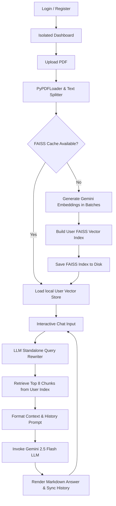

# DocMind AI - Grounded Document Intelligence

DocMind AI is a professional, responsive Retrieval-Augmented Generation (RAG) chatbot web application that allows multiple users to upload, index, and have secure, private interactive chats with PDF documents. 

Featuring a premium **Obsidian Gold** glassmorphic aesthetic, the application leverages Google Gemini embeddings and LLMs via LangChain, utilizing local FAISS vector stores namespaced per user for private, fast semantic search.

---

## 🚀 Key Features

*   **Secure User Authentication**: Full Login and Registration interface backed by an SQLite database (`users.db`) using secure password hashing (PBKDF2 with SHA-256 and salt).
*   **Isolated User Contexts**: Strict namespacing of PDF uploads and FAISS embedding stores by username (`backend/uploads/{username}/` and `backend/faiss_cache/{username}/`), ensuring data privacy across user accounts.
*   **ChatGPT-style Chat Sessions**: Client-side session persistence via `localStorage` allowing users to manage multiple, isolated chat histories. Users can create, switch between, and delete past conversations at will.
*   **Contextual Query Rewriting**: Utilizes the Gemini LLM to rewrite context-dependent follow-up queries (e.g., *"give me a 20 mark answer for the same above"*) into standalone, search-optimized vector database queries based on conversation history.
*   **Premium Obsidian Gold UI**: Responsive and modern user interface featuring:
    *   Glassmorphic layouts, animated gold gradients, and micro-interactions.
    *   Manual class-based Light/Dark Mode toggle.
    *   Fully responsive sidebar with a mobile drawer slide-out menu.
    *   "Copy to Clipboard" utility icons on AI responses.
    *   Intuitive empty-state guide cards and drag-and-drop file upload zones.
*   **API Rate Limit Protection**: Built-in exponential backoff and retry logic handles Gemini's free-tier rate limits (`RESOURCE_EXHAUSTED` / `429`) automatically, making it safe to index large documents.
*   **Semantic Text Chunking**: Pre-configured with an optimized chunk size of 1000 characters and a 200-character overlap to preserve sentences, context, and structural meaning.
*   **Strict Context Boundary**: The LLM is restricted to answering *only* using the text retrieved from your PDF. If the answer isn't in the document, it will gracefully inform the user.
*   **Interactive Conversational CLI**: A clean, loop-based command-line interface is also provided in `main.py` for terminal-based chats.

---

## 🛠️ Architecture & Workflow

The system operates on the following RAG lifecycle:



---

## 📋 Prerequisites

*   Python 3.9 or higher
*   Node.js (v18+ recommended)
*   A Google Gemini API key (Obtain one for free at [Google AI Studio](https://aistudio.google.com/))

---

## ⚙️ Installation & Setup

1.  **Clone the Repository**
    ```bash
    git clone https://github.com/prashaantv05/rag-pdf-chat.git
    cd rag-pdf-chat
    ```

2.  **Configure Environment Variables**
    Create a `.env` file in the root of the project:
    ```env
    GOOGLE_API_KEY=your_actual_gemini_api_key_here
    ```

### 🐍 Backend Setup
1.  Navigate to the backend directory:
    ```bash
    cd backend
    ```
2.  Set up a Virtual Environment:
    ```bash
    python -m venv venv
    
    # On Windows (PowerShell)
    .\venv\Scripts\Activate.ps1
    
    # On macOS/Linux
    source venv/bin/activate
    ```
3.  Install dependencies:
    ```bash
    pip install -r requirements.txt
    ```
4.  Start the FastAPI server:
    ```bash
    uvicorn app:app --reload --port 8000
    ```

### ⚛️ Frontend Setup
1.  Navigate to the frontend directory:
    ```bash
    cd ../frontend
    ```
2.  Install packages:
    ```bash
    npm install
    ```
3.  Run the development server:
    ```bash
    npm run dev
    ```

---

## 🏃 Usage

### Web Interface
1. Once both servers are running, navigate to `http://localhost:5173/` in your browser.
2. Register an account and sign in.
3. Drag and drop a PDF file (e.g., the included `sample.pdf`) into the upload dropzone.
4. Once processed, you can begin chatting. Your session will be saved in the "Recent Chats" list on the sidebar.

### Command-Line Interface (CLI)
For a terminal-based interface, configure `PDF_FILE_PATH` in `main.py` and run:
```bash
python main.py
```

---

## ⚠️ Limitations & Troubleshooting

### 1. Free-Tier Rate Limits (RESOURCE_EXHAUSTED)
Google's Gemini API free tier enforces strict rate limits for embeddings (`gemini-embedding-001`):
*   **100 requests per minute (RPM)**: The backend automatically sleeps for 70 seconds to allow the sliding window to clear and retries, but it makes first-time indexing of large PDFs slow.
*   **1,000 requests per day (RPD)**: If you exhaust your daily quota, the API will reject all requests. 
    *   *Workaround:* Switch to a paid tier (extremely low cost) or set a fresh key in `.env`.

### 2. Database Locking
If you run concurrent development threads or hit connection errors, SQLite databases can occasionally throw a `"database is locked"` operational error. 
*   *Solution:* We have implemented a 15-second connection timeout and wrapped all SQL connections inside strict `try...finally` blocks in `backend/database.py` to guarantee connections are closed and locks are released automatically.

### 3. Text-Only Extraction
*   The script uses a standard PDF text parser (`PyPDFLoader`). It does **not** support OCR for scanned document images, nor can it index diagrams or images embedded inside PDFs.
