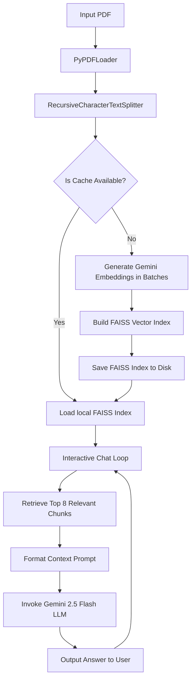

# PDF RAG Chatbot with Gemini & FAISS

A local Retrieval-Augmented Generation (RAG) chatbot that allows you to upload, index, and have interactive chats with any PDF document. It leverages Google Gemini embeddings and LLMs via LangChain, utilizing a local FAISS vector store for fast semantic search.

---

## 🚀 Key Features

*   **Dynamic Document Caching**: Automatically calculates a hash/name-based index for each PDF. If a PDF has already been processed, it loads the vector store instantly from disk (`faiss_cache/`) without repeating costly API calls or document parsing.
*   **API Rate Limit Protection**: Built-in exponential backoff and retry logic handles Gemini's free-tier rate limits (`RESOURCE_EXHAUSTED` / `429`) automatically, making it safe to index large documents.
*   **Semantic Text Chunking**: Pre-configured with an optimized chunk size of 1000 characters and a 200-character overlap to preserve sentences, context, and structural meaning.
*   **Interactive Conversational CLI**: A clean, loop-based command-line interface that retrieves context and generates highly accurate answers from your document in real-time.
*   **Strict Context Boundary**: The LLM is restricted to answering *only* using the text retrieved from your PDF. If the answer isn't in the document, it will gracefully inform you.

---

## 🛠️ Architecture & Workflow

The chatbot operates on the following RAG lifecycle:



---

## 📋 Prerequisites

*   Python 3.9 or higher
*   A Google Gemini API key (Obtain one for free at [Google AI Studio](https://aistudio.google.com/))

---

## ⚙️ Installation & Setup

1.  **Clone the Repository**
    ```bash
    git clone https://github.com/prashaantv05/rag-pdf-chat.git
    cd rag-pdf-chat
    ```

2.  **Set Up a Virtual Environment**
    ```bash
    python -m venv venv
    
    # On Windows (Command Prompt)
    venv\Scripts\activate
    
    # On Windows (PowerShell)
    .\venv\Scripts\Activate.ps1
    
    # On macOS/Linux
    source venv/bin/activate
    ```

3.  **Install Dependencies**
    ```bash
    pip install -r requirements.txt
    ```

4.  **Configure Environment Variables**
    Create a `.env` file in the root of the project:
    ```env
    GOOGLE_API_KEY=your_actual_gemini_api_key_here
    ```

---

## 🏃 Usage

1.  Place the PDF you want to query inside the project directory.
2.  Open [main.py](file:///d:/Prashaant/WebDevProjects/rag-pdf-chat/main.py) and update the `PDF_FILE_PATH` config variable at the top:
    ```python
    PDF_FILE_PATH = "your_document.pdf"
    ```
3.  Run the application:
    ```bash
    python main.py
    ```

---

## ⚠️ Limitations

While this project is optimized for performance, users should keep the following limitations in mind:

### 1. Free-Tier Rate Limits (RESOURCE_EXHAUSTED)
Google's Gemini API free tier enforces two strict rate limits for embeddings (`gemini-embedding-001`):
*   **100 requests per minute (RPM)**: Since each text chunk counts as 1 request, documents yielding more than 100 chunks will trigger a rate limit warning. The code automatically sleeps for 70 seconds to allow the sliding window to clear and retries, but it makes first-time indexing of large PDFs slow.
*   **1,000 requests per day (RPD)**: If you index multiple large files or wipe your cache folder repeatedly, you will exhaust your daily quota. Once hit, the API will reject all requests until the quota resets at midnight Pacific Time. 
    *   *Workaround:* Switch to a paid tier (pay-as-you-go is extremely cheap) or create a new project in Google AI Studio to get a fresh API key.

### 2. Context Window & Retrieval Limits
The chatbot retrieves the **top 8 closest text chunks** (`k=8`) as context for the LLM. 
*   If your query requires connecting information spread across more than 8 distinct regions of a very large document, some parts of the context might not be sent to the LLM.

### 3. Text-Only Extraction
*   The script uses a standard PDF text parser (`PyPDFLoader`). 
*   It does **not** support OCR (Optical Character Recognition) for scanned document images, nor can it index diagrams, charts, or images embedded in the PDF.

### 4. Cache De-synchronization
*   The cache checks if the folder `faiss_cache/<pdf_name>` exists. 
*   If you modify the content of a PDF but keep the **same filename**, the script will load the old cached vectors instead of updating.
    *   *Fix:* Manually delete the corresponding folder in `faiss_cache/` to force a rebuild.
